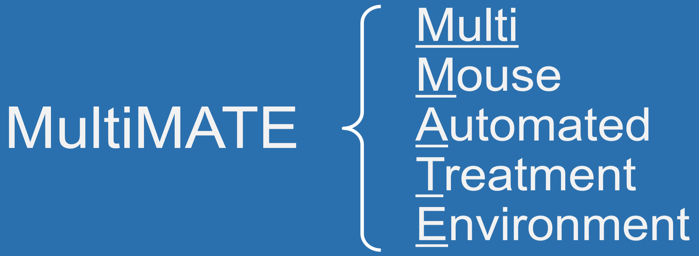
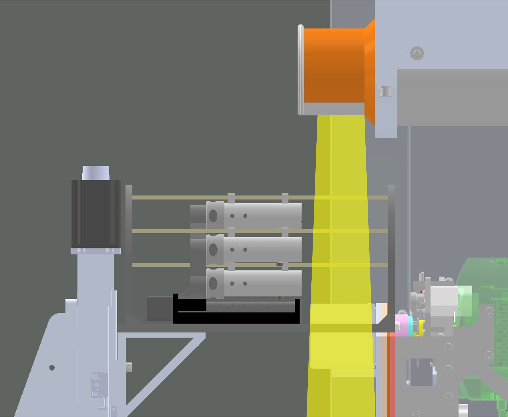
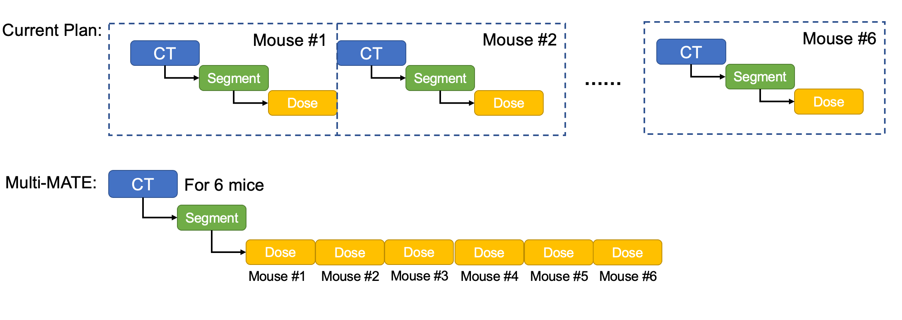
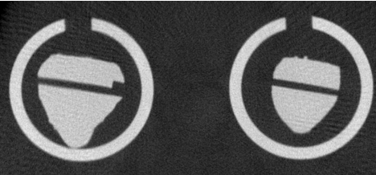

The MultiMATE is a hardware platform for automating the delivery of x-ray radiation to small animal subjects (mice) without requiring costly repositioning operations between each subject. Multi-MATE is composed of six parallel channels, each with a transfer rail, a 3D-printed immobilization pod, and an electromagnetic control unit. It is computer-controlled by an Arduino interface. With a 3D-printed support base, the platform attaches to the treatment couch of an X-RAD SmART image-guided small-animal irradiator.

During the experiment process, the mouse immobilization pods are transported along the rails between the home position away from the radiation field and the imaging/irradiation position in the center of the field. In the proposed workflow, all six mice are transferred to the imaging/irradiation position for initial CBCT scans, which are used for treatment planning. The mice are then sequentially transported to the imaging/ irradiation position for dose delivery.  The procedure repeats for each mouse in an automatic manner before the treatment concludes and the irradiator door can be opened again. Throughput is theoretically >6x since setup for each mouse can be done at the same time.

## Uploading Firmware
Arduino firmware may be updated using either:
* Aduino IDE with board set to MEGA2560
* VSCode IDE + PlatformIO Extension (and .platformio config file in this repo)

## Communicating with Arduino (via serial)
Commands can be sent to the hardware using either of the following serial monitors (others available as well):
* Arduino provided Serial Monitor
* VSCode IDE + PlatformIO Serial Monitor (or via command `platformio device monitor`)

Accepted commands will be listed upon first connection with arduino (or after issuing `HELP` command to serial monitor).

## Figures

# Citation
title = {Technical Note: Multi-MATE, A High-Throughput Platform For Automated Image-Guided Small-Animal Irradiation}
Author = {Lu Jiang, Pavitra Ramesh, Ryan Neph, Ke Sheng}
The manuscript was recently accepted by Medical Physics and it was in press.